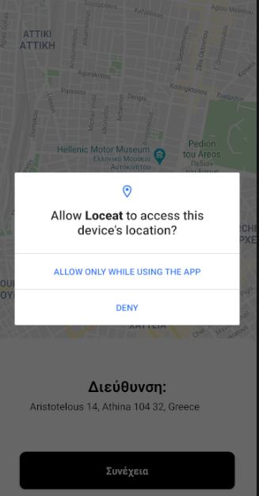
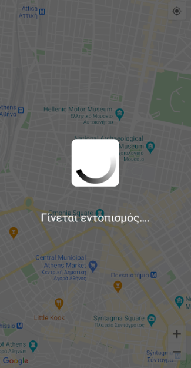
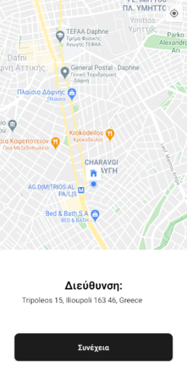
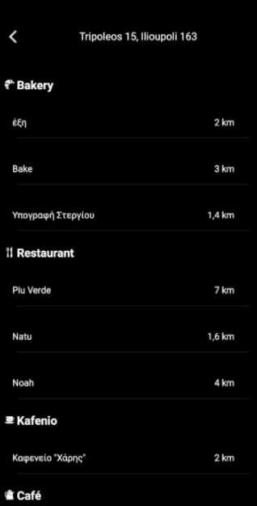

# 
Loceat lets users list local restaurants based on their current position or a default location. I am using the free Places API provided by Foursquare in order to fetch restaurants data.

### How To Use This

1. Clone or download github project
2. Extract it
3. Open it in Android Studio. File >> Open
4. Build >> Build Apk(s)

### Development
If you want to work on this application we’d love your pull requests and tickets on GitHub!

1.If you open up a ticket, please make sure it describes the problem or feature request fully.
##

